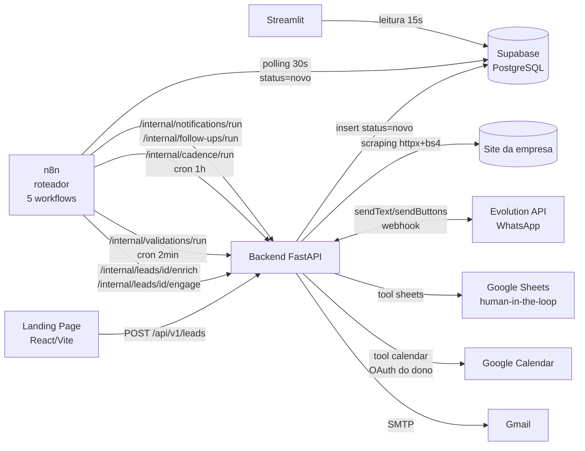

# Arquitetura da solução

## Visão geral

O sistema segue Clean Architecture no backend: **rotas** (controladores finos) →
**services** (regras de negócio) → **agent** (LangChain: chains, tools, memory, prompts) →
**core** (config e infraestrutura). O n8n fica fora do domínio: é somente o roteador de
gatilhos; a Evolution API é o canal de WhatsApp; o Supabase é a única fonte de verdade.



## Fluxo do LangChain

### Componentes (backend/agent/)

| Arquivo | Responsabilidade |
|---|---|
| `prompts.py` | Templates de sistema PT-BR: resumo de enriquecimento, agente pré-evento (Sofia — qualificação, curadoria, confirmação, acompanhantes), agente pós-evento (follow-up comercial), kickoffs (incl. os 7 toques da régua proativa `CADENCE_KICKOFFS`). |
| `memory.py` | Memória nativa do LangChain: `PostgresChatMessageHistory` (langchain-postgres) na tabela `langchain_chat_history` do Supabase. Cada conversa tem um `session_id` UUID. |
| `chains.py` | Fábricas dos fluxos: chain de enriquecimento (`prompt \| ChatAnthropic \| JsonOutputParser`) e agentes conversacionais (`create_tool_calling_agent` + `AgentExecutor` + `RunnableWithMessageHistory`), com normalização do output do Claude para texto puro antes de persistir na memória. |
| `tools/scraper.py` | Scraping institucional (httpx + BeautifulSoup); usado diretamente pela chain de enriquecimento (`scrape_site()`), não é uma tool do agente conversacional. |
| `tools/sheets.py` | `registrar_lead_curadoria`, `consultar_validacao_linkedin` — escreve/lê a planilha da curadoria humana (gspread), mapeando colunas por palavra-chave. |
| `tools/calendar.py` | `verificar_disponibilidade`, `agendar_reuniao` — free/busy real da agenda do dono (OAuth), cria a reunião comercial pós-evento e persiste em `meetings`. |
| `tools/confirmation.py` | `enviar_botao_confirmacao`, `confirmar_inscricao` — mensagem interativa de confirmação (com fallback texto) e efetivação da confirmação de inscrição. |
| `tools/crm.py` | `atualizar_status_lead` (allowlist de status), `registrar_acompanhantes` (0–2) — únicas portas de escrita do agente no funil. |

### Composição por fase

| Fase | System prompt | Tools disponíveis |
|---|---|---|
| Pré-evento | `PRE_EVENT_SYSTEM_PROMPT` (lead + contexto enriquecido + dados do evento) | `registrar_lead_curadoria`, `consultar_validacao_linkedin`, `enviar_botao_confirmacao`, `confirmar_inscricao`, `registrar_acompanhantes`, `atualizar_status_lead` |
| Pós-evento | `POST_EVENT_SYSTEM_PROMPT` (mesmo contexto, objetivo = reunião) | `verificar_disponibilidade`, `agendar_reuniao`, `atualizar_status_lead` |

A **régua proativa** (toques anti no-show entre a qualificação e o evento) não é uma
fase própria do agente — é o `cadence_service` (fora do LangChain) decidindo *quando*
reabrir a conversa pré-evento existente com um kickoff específico (`CADENCE_KICKOFFS`);
o agente responde com as mesmas tools da fase pré-evento. Ver `docs/communication.md`
para as regras de negócio de cada toque.

As tools são criadas por **fábricas com closure do lead** (`make_sheets_tool(lead)`,
`make_calendar_tool(lead)`, `make_crm_tool(lead_id)`, etc.): o LLM nunca escolhe *de qual
lead* está falando — o backend injeta essa amarração, eliminando uma classe inteira de
erros e de prompt injection.

### Ciclo de um turno de conversa

```
Evolution webhook (MESSAGES_UPSERT)
  └─ whatsapp_service.parse_incoming()      normaliza telefone/texto, descarta ruído
      └─ agent_service.handle_incoming_message()
          ├─ localiza lead (telefone_e164) e conversa ativa (pós > pré)
          ├─ build_*_chain(lead, contexto)   monta agente da fase com as tools do lead
          └─ chain.invoke({input}, config={session_id})
              ├─ RunnableWithMessageHistory carrega o histórico do Postgres
              ├─ AgentExecutor: Claude decide responder ou chamar tools (loop ≤ 6)
              ├─ histórico (humano + IA) persistido automaticamente
              └─ resposta → whatsapp_service.send_text()
```

**Rede de segurança**: se qualquer tool ou o LLM falhar de um jeito que o prompt não
previu (ex.: credencial do Google Calendar expirada), `agent_service.handle_incoming_message`
captura a exceção e garante que o lead recebe uma mensagem de desculpas em vez de silêncio —
uma falha interna nunca deve parecer "o agente parou de responder" do lado de fora.

A memória é **exclusivamente** do LangChain: o backend nunca lê/escreve
`langchain_chat_history`; ele só gerencia o vínculo negócio↔sessão na tabela
`conversations` (lead, fase, status). Isso permite retomar o contexto no pós-evento com
zero código de "replay": basta invocar a chain da nova fase — o histórico pré-evento
permanece na sessão antiga e a nova fase começa limpa, com o relacionamento resumido no
system prompt.

### Transições de status

O enum `status_lead` divide a autoria das transições:

- **Backend (operacional):** `novo → enriquecendo → enriquecido → em_conversa`,
  `compareceu → em_follow_up`.
- **Agente (via tool `atualizar_status_lead`, allowlist):** `aguardando_validacao`,
  `qualificado`, `desqualificado`, `confirmado`, `reuniao_agendada`, `perdido`.
- **Humano/organização (SQL ou futuro admin):** `compareceu`, `ausente` (check-in do evento).

Toda transição gera uma linha em `agent_events` (auditoria).

## Decisões e trade-offs

1. **Polling vs webhook no gatilho do n8n** — o n8n roda local (Docker) e o Supabase é
   cloud: um Database Webhook exigiria expor o n8n via túnel. O polling de 30s na REST do
   Supabase funciona 100% local e o lock otimista (`status=enriquecendo`) o torna idempotente.
   Em produção (n8n com URL pública), basta trocar o trigger do workflow 01 por um
   Database Webhook do Supabase (INSERT em `leads`) — nenhuma mudança no backend.
2. **Sequenciamento enrich→engage no n8n** — são dois endpoints separados chamados em
   sequência pelo workflow. O n8n continua sem lógica (só ordem de chamadas); manter os
   endpoints separados dá observabilidade por etapa e permite reprocessar só o que falhou.
3. **Memória por fase (2 sessões) em vez de sessão única** — evita que o agente pós-evento
   "continue" mecanicamente a conversa de qualificação; o vínculo é mantido pelo system
   prompt + dados do lead, não pelo transcript bruto.
4. **Tool de CRM em allowlist** — o agente altera o funil apenas por estados de negócio
   permitidos; estados operacionais são inalcançáveis pelo LLM.
5. **Modelo** — `claude-opus-4-8` (padrão atual mais capaz da família Opus). Trocar de
   modelo é uma env var; nenhuma mudança de código.
6. **RLS ligado sem policies** — o acesso anônimo ao Supabase é negado; backend e dashboard
   usam a service key. A landing nunca fala com o Supabase diretamente — só com o backend.

## Segurança

- Endpoints internos exigem `X-API-Key` (chave compartilhada com o n8n).
- CORS restrito às origens da landing.
- Segredos só em `.env` (nunca commitados); service account do Google em `credentials/`.
- O webhook da Evolution responde 200 sempre e descarta payloads inválidos sem processá-los.
